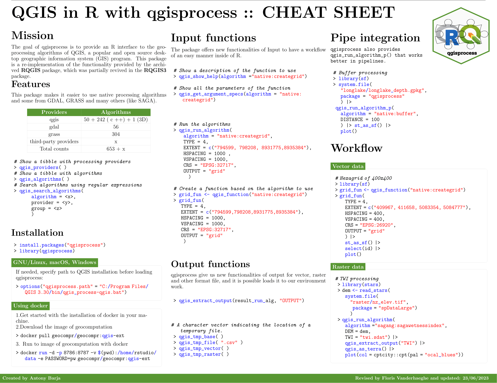

# **Cheatsheet for qgisprocess in R** 

If you have contribute, please, click on **Contribute** 👇:  

This repository stores a cheat sheet and logo of the [qgisprocess]() package in R in pdf and png formats. The colours considered for the development were taken from the official [QGIS website](https://qgis.org/en/site/getinvolved/styleguide.html). The software used for content creation was free and open source such as [Inkscape](https://inkscape.org/es/) and [overleaf](https://overleaf.com/).
If you found my work useful, please consider inviting me for a [cup of coffee](https://ko-fi.com/ambarja).

 

<table>
  <tr align='center'>
   <td></td>
   <td></td>

  </tr>
  <tr align='center'>
    <td><h3><b>English</b></h3></td>
    <td><h3><b>Spanish</b></h3></td>
  </tr>
  <tr align='center'>
    <td><h4><b>📥<a href='https://github.com/ambarja/cheatsheet-qgisprocess/raw/main/pdf/english/qgisprocess_en.pdf'>PDF Download</a></b></h3></td>
    <td><h4><b>📥<a href='https://github.com/ambarja/cheatsheet-qgisprocess/raw/main/pdf/spanish/qgisprocess_es.pdf'>PDF Download</a></b></h3></td>
  </tr>
</table>
