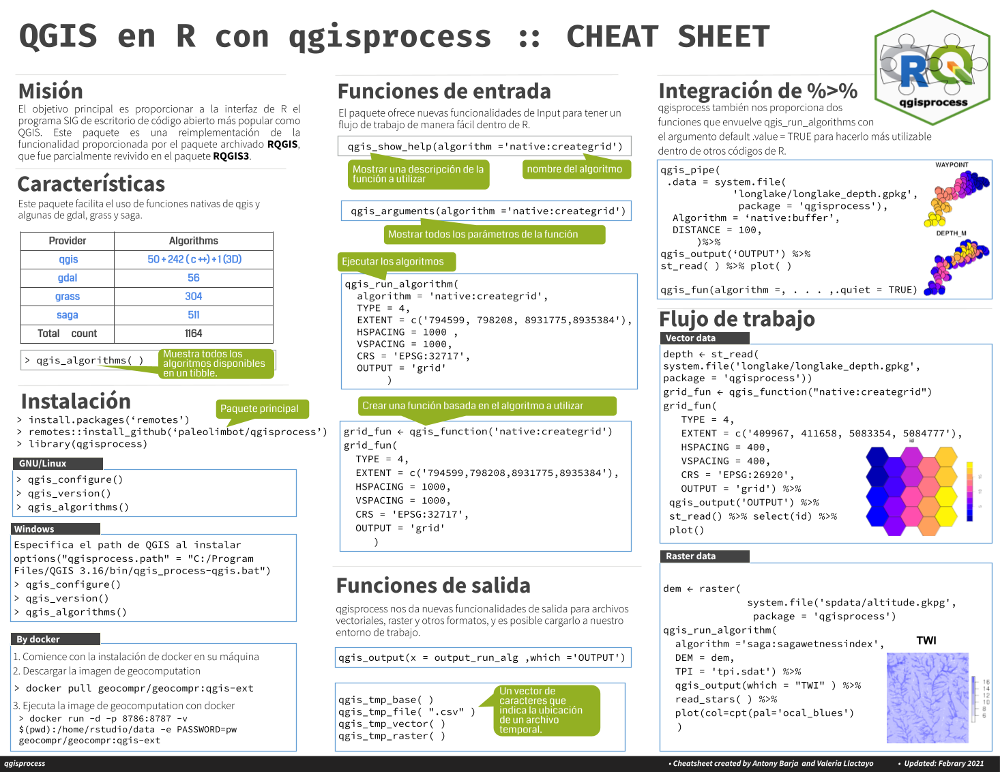

# **Cheatsheet for qgisprocess in R**

This repository stores in pdf and png format a cheat sheet and logo of the qgisprocess package in R. 
The colours considered in these were taken from [the official QGIS website](https://qgis.org/en/site/getinvolved/styleguide.html).
The software used for the creation of the logo was inkscape and for the cheat sheet was an official power point template shared by the posit cheat sheet repository.
 

<table>
  <tr>
   <td></td>
   <td></td>

  </tr>
  <tr align='center'>
    <td><h3><b>English</b></h3></td>
    <td><h3><b>Spanish</b></h3></td>
  </tr>
  <tr align='center'>
    <td><h3><b>📥<a href=''>PDF Download</a></b></h3></td>
    <td><h3><b>📥<a href=''>PDF Download</a></b></h3></td>
  </tr>
</table>

